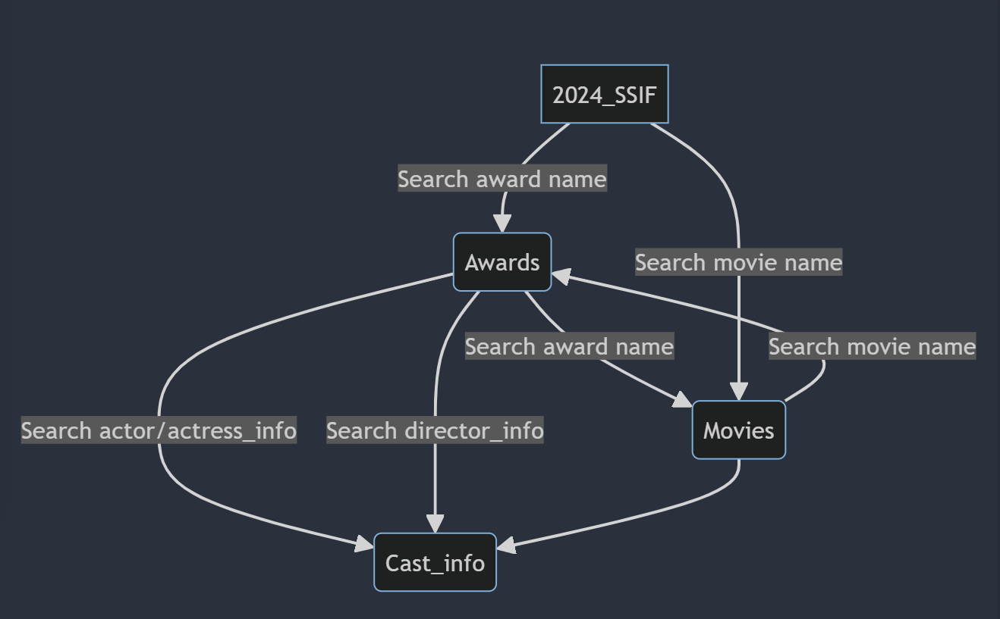

# Design Document

By Qin He Lily

Video overview: 

## Scope

The database for CS50 SQL includes all entities necessary to facilitate the process of tracking 2024 Shanghai Internatinal Festival Film entries and winners as well as introducing prominent films and cast. As such, included in the database's scope is:

* 2024_SSIF, including basic entries information
* Awards, including basic awards information
* Movies, including the id, name, film_genre at which the film belongs to, the film_duration how long it plays, film_year at which year it was made, fim_historic_countries where it releases, film_scores,the comprehensive score it received, film_ratings the conmments numbers it recieved, film_short_synopsis the short introduction of itself, the film_trailor_url where to watch the trailor, the film_intro_url that the comprehensive web-page introduction url address. 
* cast_info, including cast's basic info of the movie  

Out of scope are elements like ceremony info, audience info, and other non-core attributes.

## Functional Requirements

This database will support:
* CRUD operations for 2024 SIFF staff and audience
* Tracking all award entries, film_info updates(trailor_url and general_url, ratings and scores are dynamic)
* search of cast_info are convenient related to prominent film

Note that in this iteration, the updates relies on manual change or re-achieving data from related sources.

## Representation

Entities are captured in SQLite tables with the following schema.

### Entities

The database includes the following entities:

#### 2024_SIFF

The `2024_SIFF` table includes:

* `film_name`, which specifies the unique name for the festival entries as an `TEXT`. This column thus has the `PRIMARY KEY` constraint applied.
* `director_name`, which specifies the director/producor's name as `TEXT`, given `TEXT` is appropriate for name fields.

#### awards

The `awards` table includes:

* `award_name`, which specifies the unique award name for the awards as an `TEXT`. This column thus has the `PRIMARY KEY` constraint applied.
* `actor/actress_name`, which specifies the actor/actress name as `TEXT`.
* `film_name`, which specifies the film name as `TEXT`.
* `director_name`, which specifies the director name as `TEXT`.

Prinary key columns in the `awards` table are required and unique hence should have the `NOT NULL` constraint applied as well as the film name is also with `NOT NULL` constraint. No other constraints are necessary.

#### movies

The `movies` table includes:

* `id`, which specifies the unique ID for one mmovie as an `INTEGER`. This column thus has the `PRIMARY KEY` constraint applied.
* `name`, which is an `TExT` is required as contraints thus have the `NOT NULL` constraint. 
* `film_duration`, which is the time-length of the film as `INTEGER`.
* `film_year`, which is the year of the film released as `INTEGER`.
* `film_historic_countries`, which is the on air countries of the film as `TEXT`.
* `film_scores`, which is the rating score at scale of 10 of the film as `INTEGER`.
* `film_ratings`, which is the rating numbers of the film as `INTEGER`.
* `film_short_sunopsis`, which is the brief introduction of the film as `TEXT`.
* `film_trailor_url`, which is the url of the film trailor as `TEXT`.
* `film_intro_url`, which is the url of the film introduction as webpage as `TEXT`.

Prinary key columns in the `movies` table are required and unique hence should have the `NOT NULL` constraint applied as well as the film_name is also with `NOT NULL` constraint. No other constraints are necessary.

#### cast_info

The `cast_info` table includes:

* `id`, which specifies the unique ID for the cast as an `TEXT`(It is stored as text instead of integer in the source data). This column thus has the `PRIMARY KEY` constraint applied.
* `name`, which is the name of the cast as an `TEXT`.
* `position`, which is the position of the cast as an `TEXT`. This column thus usually can be `direcor`,`actor`,`producor` and etc.

Prinary key columns in the `cast_info` table are required and unique hence should have the `NOT NULL` constraint applied. No other constraints are necessary.

### Relationships

The below entity relationship diagram describes the relationships among the entities in the database.

As detailed by the diagram:

* One entry can only be nominated to one award and got one info stored as one movie in the movies.
* one Award can be used  to search detail info of the prominnt movie by given awa name. Meanwhile, one movie in the movies can be searched with the name to check if won an award stored in the awards. 
* As nominated in some specific award, the actor/actress or director given can also be checked info in the cast_info in one direction only.
* Cast_info can be achieved through movies in one direction only as well.

## Optimizations

Per the typical queries in `queries.sql`, it is common for users of the database to access all info of the movie which is awarded or not. For that reason, indexes are created on the `name`,`award_name` columns to speed the identification of movies and awards by those columns.

Similarly, it is also common practice for a user of the database to concerned with checking if any film is good enough so as to be awarded in 2024_SIFF. As such, an index is created on the `name` column in the `movies` table to speed the award check of the movie by name.

## Limitations

The current schema assumes the data achieved already in advance (although can be update on related source) and can be changed with CRUD operations manually only in the other way. And the data currently is only about 2024 year.(Will be extended to other 15 years as well.)
